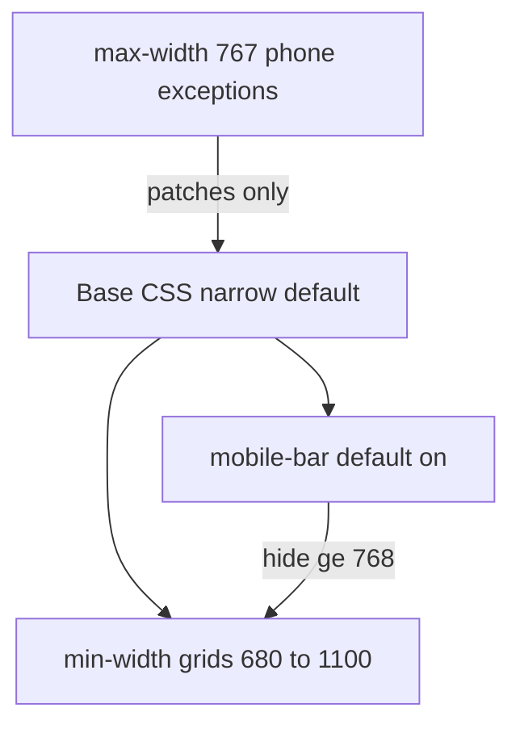

# ADR: Mobile-first vs híbrido na landing

- Status: accepted
- Data: 2026-08-24

### Para o Álvaro (gestor)
- Pedido: o site está pensado mobile-first?
- Resultado vs objetivo: **não bate com “mobile-first puro”** — está **híbrido** (base + `min-width` para crescer grids + um bloco `max-width: 767px` para exceções de telefone)
- Os 3 selos: Entrega (ship deste ADR = docs/comentário) · Fecho (`FECHO_OK` não — Goals MISSING) · Mundo real (`PROD_IO_AUTH: nao`)
- Residual / risco: sem Goals confirmed; sem eye-test em device físico; espelho `landing/` ↔ `docs/`
- O que preciso de ti: nada (decisão gravada)
- Respostas gravadas:
  - Q1: Aceitas manter o híbrido (sem rewrite “mobile-first puro”) enquanto o telefone continuar usável? → **sim** (Álvaro, 2026-08-24)
  - Q2: Queres Goals de funil mobile confirmados agora? → **não neste ship** (proposta mantida; sem pedido contrário)

## Contexto
Contagem em `landing/styles.css`: ~12 `@media (min-width: …)` e **1** `@media (max-width: 767px)` com patches de conversão (badge, WA curto, offset da barra, tap 44px). A `mobile-bar` já é MF (visível na base, escondida ≥768). Chamar isso de “mobile-first” seria marketing interno falso.

## Decisão
1. **Nomear a verdade:** estratégia = **híbrido progressivo** (`min-width` para layout) + **exceções phone** (`max-width: 767px`).
2. **Não** reescrever o CSS só para “parecer” mobile-first (custo/regressão sem ROI com Goals MISSING).
3. Manter contrato phone do ADR-001 (safe-area, offset, taps ≥44px).

## Alternativas rejeitadas
1. Claim “já é mobile-first” — desonesto face à contagem 12+1.
2. Rewrite total invertendo o dump `max-width` — ritual; devil Simplicidade: mais cascata, sync duplo `docs/`+`landing/`, sem prova de conversão.

## Invariantes
- Telefone usável sem scroll-X; CTA close acima da barra; 1 CTA WA
- Uma fonte canónica `landing/`; `docs/` = espelho Pages
- Labels: `VISUAL_DRAFT` ≠ `DESIGN_APPROVED`

## Não muda
- Redesign de secções, tipografia, stack, backend, Goals inventados

## Advogado do diabo (subagents)
- Lens-BO: slogan MF mascara risco de conversão; rewrite sem KPI queima tempo → aceite phone observável, não arquitetura por estética
- Lens-Verdade: 12 min + 1 max = híbrido; ban “mobile-first” até redesign explícito
- Lens-Simplicidade: inverter dump ≠ menor mudança; provar num ficheiro, espelhar depois

## Diagrama



## Árvore de impacto
- TREE_X: honestidade da estratégia responsiva (híbrido)
- TREE_1: `landing/styles.css`, `docs/styles.css` (espelho), ADR
- TREE_2: ADR-001 phone contrato; Pages `/docs`
- EDGE: Contract=comentário+ADR; Capacity N/A; Trust N/A; Money N/A; Obs=verify conta media queries

## Plano de verificação
```bash
rg -c '@media \\(min-width' landing/styles.css
rg -c '@media \\(max-width: 767' landing/styles.css
./tests/verify-landing-mobile.sh
```

## Riscos top 3
1. Equipa continua a dizer “mobile-first” → comentário + ADR no topo do CSS
2. Rewrite futuro por pressão estética → citar este ADR
3. Dessync docs/landing → ship sempre copia após editar landing
